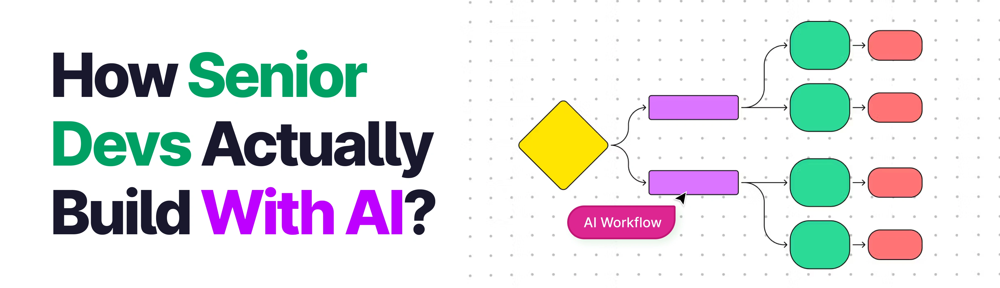

<div align="center">
  <br />
    <a href="https://youtu.be/9dKA2hq4vf0" target="_blank">
      
    </a>
  <br />

  <div>


<br />


  </div>

  <h3 align="center">JobPilot | Match-tracking AI Agent</h3>

   
</div>
 
## 📋 <a name="table">Table of Contents</a>

1. ✨ [Introduction](#introduction)
2. ⚙️ [Tech Stack](#tech-stack)
3. 🔋 [Features](#features)
4. 🤸 [Quick Start](#quick-start)
5. 🔗 [Assets](#links)
6. 🚀 [More](#more)

## 🚨 Tutorial


## <a name="introduction">✨ Introduction</a>

JobPilot is an autonomous, full-stack AI agent that transforms how technical job seekers find work by simultaneously browsing LinkedIn, Wellfound, and YC Jobs to discover, score, and apply to roles. Powered by Next.js, GPT-4o, and Browserbase/Stagehand automation, the app dynamically customizes resumes and executes real browser application forms autonomously. More than just a utility, JobPilot serves as a masterclass in modern agentic engineering, utilizing five core open-source skills—/architect, /remember, /review, /recover, and /imprint—to demonstrate how a single developer with a structured system can rapidly ship durable, production-grade AI software.

An experimental Browserbase/Stagehand apply path is included for review — see [BROWSERBASE_REPORT.md](BROWSERBASE_REPORT.md) for full details on what was attempted and where it currently stands.


## <a name="tech-stack">⚙️ Tech Stack</a>

- **[Next.js](https://nextjs.org/)** is a full-stack React framework that powers JobPilot's user interface, utilizing the App Router, Server Actions, and API Routes to deliver server-rendered components and high-performance client-side navigation.
- **[TypeScript](https://www.typescriptlang.org/)** is a strongly typed programming language that builds on JavaScript, ensuring strict type safety across the entire codebase and providing a maintainable environment for complex agent orchestration.
- **[Tailwind v4](https://tailwindcss.com/)** is a utility-first CSS framework used for rapid UI development, providing a clean, responsive, and easily customized styling infrastructure.
- **[shadcn/ui](https://ui.shadcn.com/)** is a collection of re-usable UI components built using Radix Primitives and Tailwind CSS, serving as the design system for the app's dashboard, tables, and job inventory views.
- **[OpenAI GPT-4o](https://openai.com/)** is a highly capable multimodal AI model that serves as the core intelligence engine, parsing job descriptions to compute match scores, tailoring resumes, and driving the form-filling automation logic.
- **[Stagehand](https://github.com/browserbase/stagehand)** is an AI-driven browser agent built on top of Playwright that uses LLMs to interpret page elements dynamically, allowing JobPilot to execute LinkedIn Easy Apply paths and handle external ATS form-filling.
- **[Browserbase](https://www.browserbase.com/)** is a headless cloud browser platform that manages infrastructure, session persistence, authentication states, and CAPTCHA solving so background jobs can run through realistic browser instances.
- **[InsForge](https://insforge.com/)** is a comprehensive backend-as-a-service provider that supplies the relational PostgreSQL database to manage the job inventory, handles user authentication, and provides secure file storage for assets.
- **[PostHog](https://posthog.com/)** is an all-in-one product analytics platform used to track user engagement, system performance metrics, and the success rates of automated application paths.


## <a name="features">🔋 Features</a>

👉 **LinkedIn Job Discovery**: Authenticated LinkedIn search utilizing a saved Browserbase context session to fetch job titles, companies, locations, and source/apply URLs automatically.

👉 **Match Scoring**: Advanced evaluation where each discovered job is parsed and scored against your professional profile by an LLM, then ranked by match percentage.

👉 **Job Inventory**: A central, filterable dashboard table that organizes matched jobs with quick access to source links, external apply links, application types, and real-time status.

👉 **Job Details**: A dedicated, per-job review view featuring a transparent match breakdown, full descriptions, direct resume controls, and manual apply triggers.

👉 **Resume Generation & Tailoring**: Dynamic engine that generates a foundational resume from your user profile, then instantly customizes it to target specific job descriptions.

👉 **LinkedIn Easy Apply**: An experimental, automated application path utilizing saved LinkedIn session contexts and Stagehand DOM mode to submit applications directly.

👉 **External Apply Attempt**: An experimental, hybrid-mode browser path powered by Stagehand designed to navigate complex external ATS forms and complete inputs autonomously.

👉 **Session Recordings**: Complete transparency layer that links every automated application attempt to a Browserbase video recording URL for auditing and debugging.

And many more, including code architecture and reusability.

## <a name="quick-start">🤸 Quick Start</a>

Follow these steps to set up the project locally on your machine.

**Prerequisites**

Make sure you have the following installed on your machine:

- [Git](https://git-scm.com/)
- [Node.js](https://nodejs.org/en)
- [npm](https://www.npmjs.com/) (Node Package Manager)


**Installation**

Install the project dependencies using npm:

```bash
npm install
```

**Set Up Environment Variables**

Create a new file named `.env` in the root of your project and add the following content:

```env
NEXT_PUBLIC_INSFORGE_URL=https://9zb7h4wq.us-east.insforge.app
NEXT_PUBLIC_INSFORGE_ANON_KEY=

NEXT_PUBLIC_POSTHOG_KEY=
NEXT_PUBLIC_POSTHOG_HOST=https://eu.i.posthog.com

OPENAI_API_KEY=

BROWSERBASE_API_KEY=
BROWSERBASE_PROJECT_ID=

ADZUNA_APP_ID=
ADZUNA_APP_KEY=
```

Replace the placeholder values with your real credentials. You can get these by signing up at: [**InsForge**](https://insforge.dev/), [**Browserbase**](https://www.browserbase.com/), [**OpenAI**](https://platform.openai.com/), [**PostHog**](https://posthog.com/), [**Adzuna**](https://www.adzuna.com/)
**Running the Project**

```bash
npm run dev
```

Open [http://localhost:3000](http://localhost:3000) in your browser to view the project.

**How It Works**

1. **Set up your profile** — fill in your experience, skills, target role, salary expectations, and upload a base resume PDF
2. **Connect LinkedIn** — save a LinkedIn browser session via Browserbase so job discovery can run authenticated
3. **Find Jobs** — the agent searches LinkedIn for roles matching your target, scores each one, and saves strong matches to your job inventory
4. **Review matches** — browse the `/jobs` list, click into any role for the full description, match breakdown, and apply links
5. **Tailor and apply** — generate a tailored resume for a specific role, then use the apply links directly or trigger the experimental Browserbase apply attempt

**Browserbase Integration**

See BROWSERBASE_REPORT.md for a detailed report on how Browserbase and Stagehand are used in this project, including the full history of the apply automation experiments and the current project state.

**Deploy on Vercel**

The easiest way to deploy your Next.js app is to use the [Vercel Platform](https://vercel.com/new?utm_medium=default-template&filter=next.js&utm_source=create-next-app&utm_campaign=create-next-app-readme) from the creators of Next.js.

Check out the [Next.js deployment documentation](https://nextjs.org/docs/app/building-your-application/deploying) for more details.


